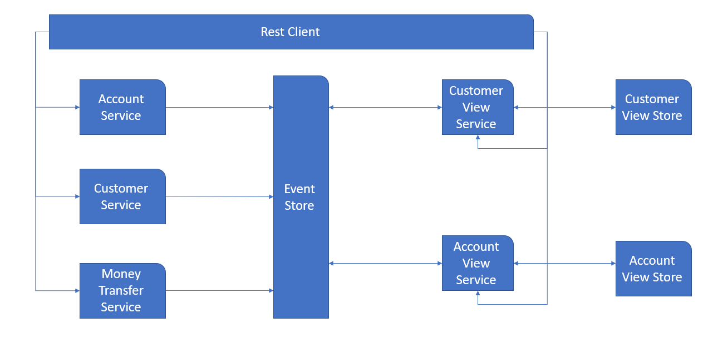

# Money Transfer Application

## Problem Domain
System enables creating customers and accounts for the customers. 

System enables money transfer between accounts of a customer and also between accounts belonging to different customers.

## Solution Architecture
System is designed using event drivent microservices architectural style by leveraging event-sourcing and CQRS techniques along with Domian Driven Design approach. 
System consists of Account, Customer and Money Transfer command services plus Account-View and Customer-View query services. Communication between command and query serivces is governed by events over an Event Store. 

Event-sourcing nad CQRS along with aysnchrounous processing in command services are chosen to offer scalability, high-throuput, low latency and high availability kind of quality attributes.

For the sake of simplicity Event Store used is a custom very primitive in-memory implementation. Customer and Account View Stores are also very primitive custom in-memory implementaions mimicking document-based NoSql data stores.

Appication is packaged as a single but modular (around domain driven microservices) monolithic application that can be easily decomposed into separate microservices.



## API Design

APIs are designed following Rest architectural style.
In command services (Customer, Account, Money Transfer) resources are created using Http POST method. These resource creations return Http 202 reposonse status to denote the request is accepted and will be processed asynchronuously along with state and resource URIs in the response body. State uri is to later check if the request succeeded or failed. If request succeeded following the resource uri will return the resource otherwise it will return Http 204 no content as response.

Following is an example of customer create rest request/response.

```
Http POST http://<server:port>/customer
{
	"firstName":"some-name",
	"lastName":"some-surname",
	"ssn":"some-ssn"
}
```
```
Http 202
{
    "stateUri": "/state/<state-id>",
    "resourceUri": "/customers/<some-ssn>",
    "customer": {
        "customerInfo": {
            "firstName": "some-name",
            "lastName": "some-surname",
            "ssn": "some-ssn"
        }
    }
}
```
## Libraries and Frameworks Used
. Dropwizard

. Netflix Governator

. Swagger2 (Open API 3)

## Running The Application

Following commands can be used to run the application.

```
mvn clean
mvn package

```

```
java -jar target/moneytransfer-1.0-SNAPSHOT.jar server config.yml
```

Hitting the url http://localhost:9090/openapi.json will return the API documentation.
And application can be driven using http://localhost:9090/{resource-path} or http://localhost:9090/}resource-path}/{resource-id}


## Tests

Unit and integration tests are under development

Some primitive unstable integration tests are under src/test/java/com/ali/integration directory. They can be run individually once the application run.

